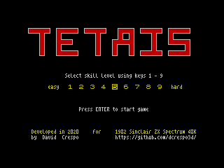
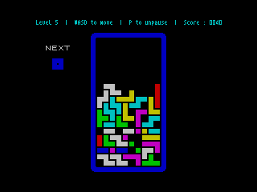

# zx-spectrum-tetris
A basic Tetris clone for the ZX Spectrum 48K developed in C

 

* * *

Game Features:
--------------

* Clean looking tetrominos, using not just the attribute block, but a black border
* Modern control using WASD keys
* 9 speed-based skill levels ranging from 1 (slow) to 9 (fast)
* Pause key for looking at that notification in your phone

* * *

Download:
---------

In the [RELEASES](https://github.com/dcrespo3d/zx-spectrum-tetris/releases) page there are .TAP / .TZX files available for use in an emulator (such as [FUSE](http://fuse-emulator.sourceforge.net/) and many others)

I have also included a .WAV file for loading on a REAL spectrum (see below)

* * *

Compiling the source code:
--------------------------

This game has been developed for the Sinclair ZX Spectrum 48K using the wonderful z88dk zcc C compiler.

https://www.z88dk.org/

z88dk is multiplatform, but I have developed this project on Windows 10 using Visual Studio Code as IDE, and compiling from the command line (CMD). Even if I don't include scripts for other platforms, it should be quite straightforward to compile these sources on a different platform.

I have used [version 1.99C](https://github.com/z88dk/z88dk/releases/tag/v1.99c) of z88dk.

In my computer, I installed z88dk onto at C:\z88dk, as it appears to be NOT relocatable.

I have provided two .BAT scripts:

* _z88dk_set_path.bat_ for setting the path for the compiler
* _tetris_compile.bat_ for compiling the tetris project

The compiler generates a .TAP file ready for opening in an emulator.

I have used [Tapir 1.0](http://live.worldofspectrum.org/files/download/85e494512c1511c) for generating a .WAV file and load the game into a REAL spectrum.

* * *

Loading on a REAL spectrum
--------------------------
I have successfully loaded and run the game in a real Sinclair ZX Spectrum 48K, loading the game from my LG G4 mobile phone using a mono 3.5 jack cable connected from the headphone port on the phone to the EAR port on the spectrum.

I use the Foobar2000 player for playing the WAV, tweaking the Foobar2000 settings. I use the DSP equalizer with all the bands set to +6 dB.

With these settings, the red/cyan stripes for the pilot tone have the same width, the load tones are heard clearly through the Spectrum speaker and the game loads OK.

When the red/cyan stripes have different widths, it is usually due to low audio volume, and games may fail to load.
